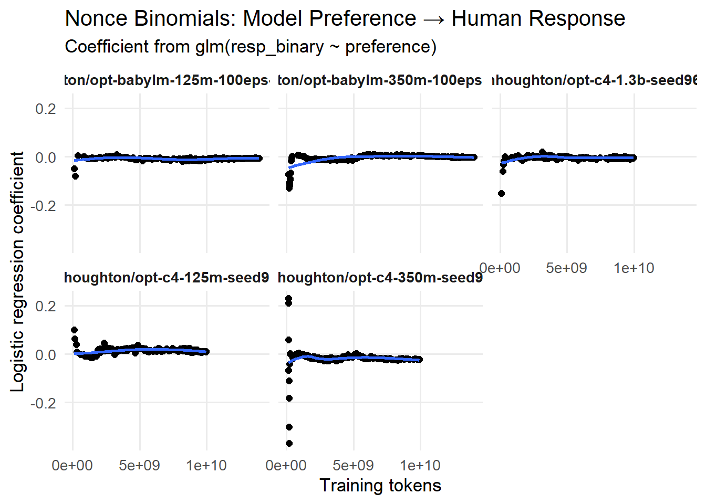
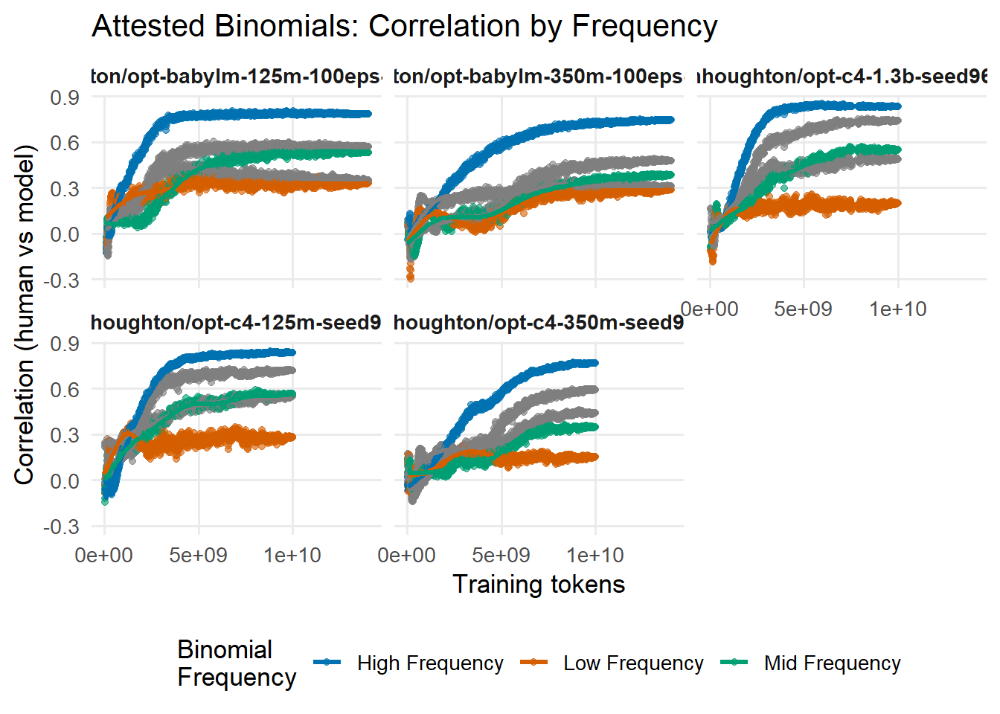
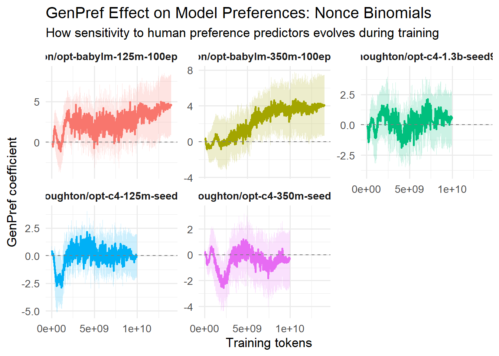
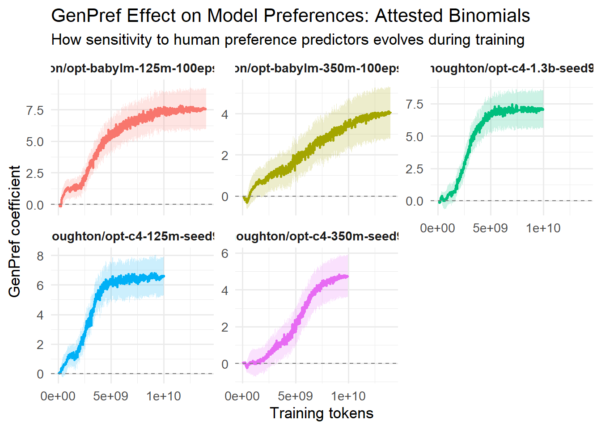
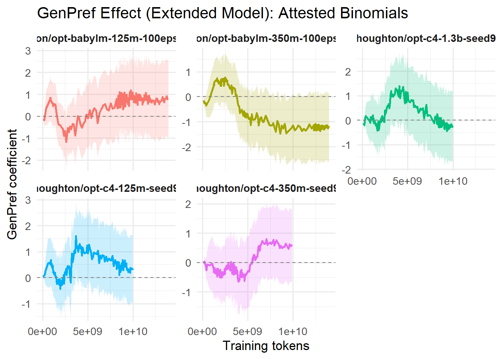
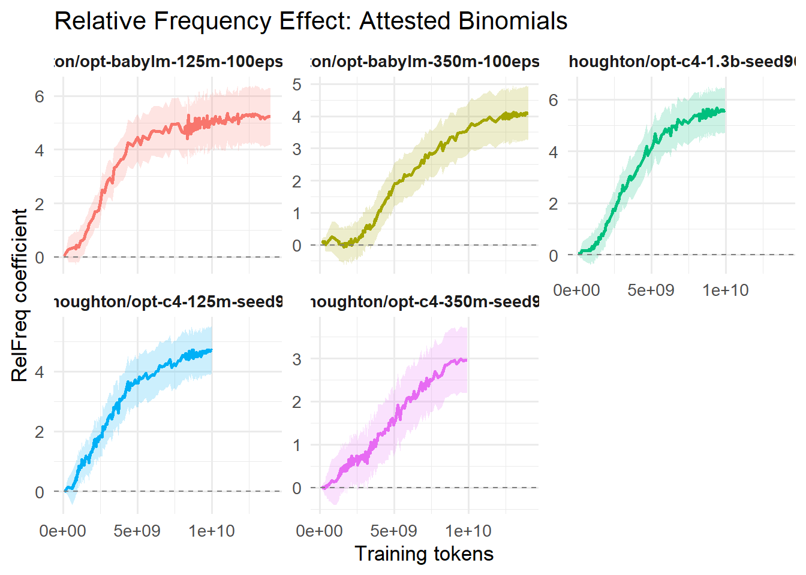
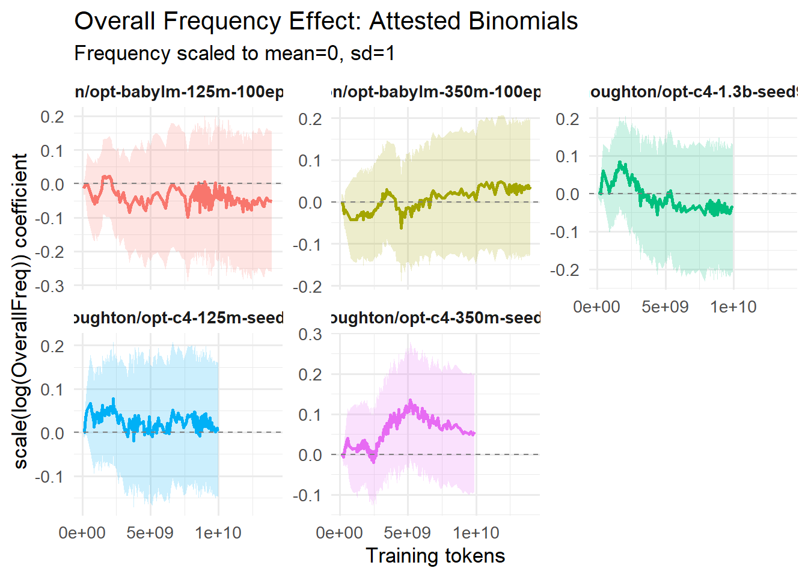
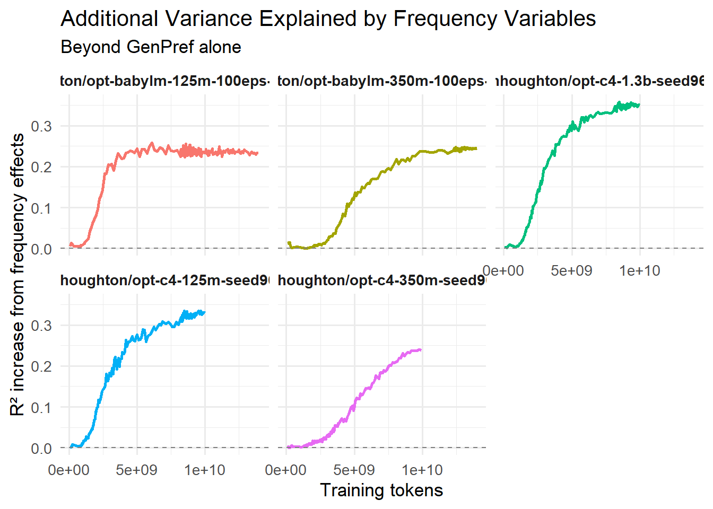

# Do Language Models Learn Binomial Ordering Preferences?

**Zachary Houghton** | February 2026

---

## Overview

### Research Question

**Do language models acquire human-like preferences for binomial ordering, and if so, do they reflect genuine abstraction of linguistic principles or surface-level memorization?**

Binomial expressions are fixed phrases in which two words are joined by "and" — *salt and pepper*, *bread and butter*, *thunder and lightning*. Speakers show strong, stable preferences for one ordering over the other, and these preferences generalize to novel word pairs never seen as binomials. This generalization implies that the ordering constraints are internalized as productive rules, not memorized item-by-item.

The constraints that drive human preferences include:

- **Phonological structure**: shorter-before-longer, avoidance of stress lapses, binary stress
- **Semantic factors**: iconicity (sequence mirrors world order), power/agency, cultural associations
- **Frequency**: more common orderings are preferred

This makes binomial ordering an ideal test of language model linguistic competence. We can separately evaluate:

1. **Attested binomials** — word pairs that appear in training data. A model could memorize these.
2. **Nonce binomials** — novel word pairs absent from training. Any alignment with human preferences must reflect generalization of abstract constraints.

The core question is whether models learn *rules* (which would generalize to novel items) or *statistics* (which would only work for seen items).

### Why Track Training Dynamics?

Rather than evaluating a single final model, we track alignment with human preferences at **every 10 million training tokens** across 10 billion total tokens. This reveals:

- *When* preferences emerge during training
- Whether generalization develops early and strengthens, or fails to appear at all
- Whether memorization and abstraction interact — do they reinforce or compete with each other?

### Key Finding (Preview)

All models memorize high-frequency corpus patterns (r = 0.60–0.84 for high-frequency attested items) but **completely fail to generalize to novel word pairs** (r ≈ 0 throughout training). Low-frequency attested items perform barely above nonce level, revealing that the true learning mechanism is **frequency-weighted exposure counting**, not rule abstraction.

---

## Datasets and Models

### Models

We trained six OPT-architecture language models from scratch. All models share the same custom BPE tokenizer (vocabulary 8,192; context length 1,024) trained on the BabyLM 100M corpus, ensuring that any differences in behavior trace to model size and training data rather than tokenization.

| Model | Parameters | Hidden Size | Attention Heads | Layers |
|-------|-----------|-------------|-----------------|--------|
| OPT-125M | 125M | 768 | 12 | 12 |
| OPT-350M | 350M | 1,024 | 16 | 24 |
| OPT-1.3B | 1.3B | 2,048 | 32 | 24 |

Each size was trained on two different corpora (see below), yielding six models total. All models use bfloat16 precision, 4,000-step linear warmup, seed 964, and 2x H100 GPUs. Models are publicly available on HuggingFace at `znhoughton/opt-{babylm,c4}-{125m,350m,1.3b}-*`.

**Model-specific training parameters:**

| Model | Learning Rate | Batch/Device | Grad. Accum. | Tokens/Step |
|-------|--------------|--------------|--------------|-------------|
| OPT-125M | 3e-4 | 400 | 1 | 819,200 |
| OPT-350M | 1e-4 | 300 | 2 | 1,228,800 |
| OPT-1.3B | 1e-4 | 100 | 4 | 819,200 |

### Training Corpora

Two training corpora were used, both delivering approximately 10 billion total training tokens:

**BabyLM** (`znhoughton/babylm-100m-v3`)

- ~100 million unique tokens of curated child-directed and child-accessible text
- Trained for **100 epochs** — the model sees the same text repeated 100 times
- Simulates a developmentally plausible acquisition scenario (limited but repeatedly encountered input)

**C4** (`znhoughton/c4-subset-10B-tokens`)

- 10 billion unique tokens from the Colossal Clean Crawled Corpus
- Trained for **1 epoch** — each example seen exactly once
- Represents standard large-scale pre-training on diverse web text

| | BabyLM | C4 |
|-|--------|----|
| Unique tokens | ~100M | ~10B |
| Epochs | 100 | 1 |
| Total training tokens | ~10B | ~10B |
| Diversity | Low (repeated) | High (diverse) |
| Repetition | High (100x) | None (1x) |

This design lets us ask: does the *type* of training data — repeated exposure to limited content vs. single-pass through diverse content — change how preferences are learned?

### Test Items and Human Data

**Binomial test items** (`nonce_and_attested_binoms.csv`) consist of:

- **Attested binomials** (`Attested == 1`): word pairs found in the BabyLM training corpus, meaning the model may have seen the preferred ordering during training
- **Nonce binomials** (`Attested == 0`): novel word pairs with no occurrence in the training corpus

We retain only items where both constituent words appear in BabyLM's vocabulary, ensuring the model has lexical knowledge of both words regardless of whether it has seen them as a pair.

**Human preference data** (`all_human_data.csv`) contains experimental judgments from participants who chose the preferred ordering for each binomial. Each response is coded as `resp_binary` (1 = alpha ordering preferred; 0 = non-alpha preferred).

### Predictors: GenPref and RelFreq

**GenPref** is a composite score capturing how strongly abstract linguistic principles predict the alpha ordering. It is derived from a logistic regression of human responses on ten linguistic features:

```
GenPref = logistic(0.022 + 0.239·Form + 0.249·Percept + 0.418·Culture
                 + 0.260·Power + 0.019·Intense + 1.304·Icon + 0.086·Freq
                 + 0.152·Len - 0.194·Lapse + 0.360·BStress) - 0.5
```

The ten predictors are: Form (phonological structure), Percept (perceptual salience), Culture (cultural associations), Power (semantic power/agency), Intense (semantic intensity), Icon (iconicity), Freq (frequency difference between words), Len (length difference), Lapse (stress lapse avoidance), and *BStress (binary stress pattern). GenPref is centered at 0 (positive = alpha ordering favored by linguistic principles).

**RelFreq** encodes the relative frequency asymmetry of the two orderings in BabyLM trigram counts, centered at 0.5. This captures corpus-specific distributional preferences.

### Evaluation Procedure

For each of the ~4,385 checkpoint files (one per model per 10M training tokens), every test binomial is evaluated across 52 different context prompts of varying lengths. For each binomial and prompt:

1. Compute log-probabilities of both orderings under the model
2. Compute `preference = log_prob(Word1 and Word2) - log_prob(Word2 and Word1)`
3. Average across all 52 prompts to get a single per-binomial preference score

Positive preference → model favors alpha ordering (Word1 first); negative → model favors non-alpha.

---

## Results

Five analyses are conducted, each tracking a different aspect of model behavior across training. For computationally intensive analyses, up to 400 checkpoints are sampled per model using **logarithmic spacing** — dense early in training (where the most change happens) and sparser at later stages.

---

### Analysis 1: Pearson Correlation Between Model and Human Preferences

**What it measures**: At each checkpoint, the Pearson correlation between model preference scores and average human preference rates (proportion of participants choosing alpha ordering) across all binomials of each type. This gives a global summary of model-human alignment.

**Nonce Binomials (generalization test)**


**Attested Binomials (memorization test)**


**Summary table of final correlations:**

| Model | Final r (Attested) | Final r (Nonce) |
|-------|--------------------|-----------------|
| BabyLM-125M | 0.60–0.65 | -0.05 to -0.10 |
| BabyLM-350M | 0.50–0.55 | -0.05 to -0.10 |
| C4-125M | ~0.70 | +0.05 to +0.10 |
| C4-350M | ~0.60 | -0.10 to -0.15 |
| C4-1.3B | ~0.70 | 0 to -0.05 |

**Key findings:**

- **All models learn attested binomials**: Correlations rise from r ≈ 0 at initialization to r = 0.60–0.70, following a sigmoidal trajectory. Learning is faster for larger models on diverse data (C4-1.3B reaches r = 0.50 within ~2B tokens).

- **No model generalizes to nonce binomials**: Final correlations cluster near zero (range: -0.15 to +0.10) regardless of model size or training data. The failure is not a matter of scale — it is consistent across all conditions.

- **C4-125M shows transient generalization**: The only sign of potential generalization is a peak of r ≈ 0.15 in C4-125M at ~2B tokens that subsequently *declines* to r ≈ 0.05–0.10 by 10B tokens. This suggests weak early abstraction that gets overwritten by memorization, not built upon.

- **Scale on repetitive data is harmful**: BabyLM-350M (r ≈ 0.50) performs *worse* than BabyLM-125M (r ≈ 0.65) despite having 3x the parameters. C4 models show the expected size benefit (125M ≈ 1.3B final performance with 1.3B learning faster). Dataset diversity is a prerequisite for positive scaling effects.

---

### Analysis 2: Logistic Regression — Model Preferences Predicting Human Choices

**What it measures**: Rather than comparing averaged preferences, this analysis fits `glm(resp_binary ~ preference, family = binomial)` at each sampled checkpoint, directly predicting individual human binary responses from model preference scores. The logistic regression coefficient (beta) indicates whether and how strongly the model's preference drives human choices. McFadden's pseudo-R² = 1 - (residual deviance / null deviance) quantifies variance explained.

This is a stricter test than correlation: it links model behavior to real human decisions at the individual-response level.

**Nonce Binomials**



**Attested Binomials**


**Key findings:**

- **Attested binomials**: The logistic coefficient for model preference grows monotonically over training for all models, mirroring the correlation results. Pseudo-R² increases from near 0 at initialization toward model-specific asymptotes, confirming that model preferences genuinely predict human choice behavior (not just an averaging artifact).

- **Nonce binomials**: Logistic coefficients stay near zero for all models at all checkpoints. No model's preference scores predict individual human responses for nonce items. C4-125M shows a small transient positive coefficient around 1–2B tokens that diminishes with continued training.

- **Interpretation**: The logistic regression confirms the correlation results and makes them concrete — a model's preference for an attested binomial is a real predictor of what a human would choose, but for nonce items, model preferences carry no predictive information about human choices.

---

### Analysis 3: Frequency-Stratified Correlation

**What it measures**: For attested binomials, items are divided into five frequency quintiles based on log-transformed corpus frequency (OverallFreq). Pearson r between model and human preferences is computed within each quintile at every checkpoint. This tests whether the aggregate attested correlation (r ≈ 0.60–0.70) is uniform across all attested items, or driven by high-frequency items.

**Plot:**



**Detailed results by model:**

**BabyLM-125M**

| Frequency Category | Final r | Mean r |
|-------------------|---------|--------|
| High Frequency | 0.781 | 0.701 |
| High-Mid | 0.569 | 0.487 |
| Mid | 0.507 | 0.398 |
| Low-Mid | 0.375 | 0.346 |
| Low Frequency | 0.322 | 0.305 |

**BabyLM-350M**

| Frequency Category | Final r | Mean r |
|-------------------|---------|--------|
| High Frequency | 0.735 | 0.565 |
| High-Mid | 0.478 | 0.292 |
| Mid | 0.356 | 0.233 |
| Low-Mid | 0.324 | 0.268 |
| Low Frequency | 0.292 | 0.193 |

**C4-125M**

| Frequency Category | Final r | Mean r |
|-------------------|---------|--------|
| High Frequency | 0.823 | 0.662 |
| High-Mid | 0.714 | 0.571 |
| Mid | 0.559 | 0.424 |
| Low-Mid | 0.549 | 0.439 |
| Low Frequency | 0.258 | 0.256 |

**C4-1.3B**

| Frequency Category | Final r | Mean r |
|-------------------|---------|--------|
| High Frequency | 0.836 | 0.681 |
| High-Mid | 0.747 | 0.556 |
| Mid | 0.544 | 0.377 |
| Low-Mid | 0.500 | 0.376 |
| Low Frequency | 0.196 | 0.165 |

**C4-350M** (anomalous — late-training degradation)

| Frequency Category | Final r | Mean r |
|-------------------|---------|--------|
| High Frequency | 0.074 | 0.494 |
| High-Mid | 0.049 | 0.334 |
| Mid | 0.049 | 0.201 |
| Low-Mid | 0.113 | 0.280 |
| Low Frequency | 0.048 | 0.134 |

**Key findings:**

- **Steep frequency gradient across all models**: High-frequency items (r = 0.74–0.84) outperform low-frequency items (r = 0.20–0.32) by a factor of ~3. This ~0.50 correlation-point gap within the attested category is larger than the gap between some attested and nonce conditions.

- **Low-frequency attested items pattern like nonce items**: Items encountered only a handful of times during training yield correlations approaching nonce-level performance (r ≈ 0.20–0.32 vs. r ≈ 0). There is no threshold at which occasional exposure yields principled abstraction.

- **The real divide is frequency, not attestation**: The aggregate attested correlation (r ≈ 0.60–0.70) is a weighted average that obscures massive variation. High-frequency items are well learned; low-frequency items are barely learned; nonce items are not learned at all. This is a continuous gradient of exposure-based memorization.

- **C4-350M anomaly**: This model shows catastrophic degradation in the final stretch of training — final correlations fall to r < 0.12 across *all* frequency categories, despite mean correlations showing normal learning earlier. Mean r's suggest the model was learning on track until late-stage collapse. Possible causes: training instability, overfitting to corpus biases that contradict human preferences, or architecture-data mismatch.

---

### Analysis 4: GenPref Effect — Linear Models Across All Checkpoints

**What it measures**: At each checkpoint, a linear regression is fit: `lm(preference ~ GenPref)`. The GenPref coefficient tracks whether model preferences are becoming aligned with the direction predicted by abstract linguistic principles (Form, Icon, Culture, etc.). A positive, growing coefficient would indicate that the model is developing sensitivity to the same factors that drive human preferences.

This is fit at **all checkpoints** (not sampled), using all nonce and attested items separately.

**Nonce Binomials**



**Attested Binomials**



**Key findings:**

- **Nonce binomials — no GenPref effect**: The GenPref coefficient remains near zero or slightly negative throughout training for all models. No model develops reliable sensitivity to the linguistic principles captured by GenPref for novel word pairs. C4-125M shows a small transient positive coefficient in early training (consistent with the correlation finding), but it does not persist or strengthen.

- **Attested binomials — GenPref coefficient grows, but why?**: The coefficient does grow over training for all attested models, broadly mirroring the overall correlation trajectory. However, this does not straightforwardly mean models are learning abstract principles — GenPref correlates with corpus frequency (high-frequency binomials tend to have clearer linguistic-principle orderings), so the growing GenPref effect for attested items may simply be a consequence of learning frequent items. Analysis 5 disentangles this.

- **The critical contrast**: GenPref grows for attested items but stays near zero for nonce items. If models were genuinely learning the abstract principles GenPref captures, the coefficient should grow for nonce items too. The attested/nonce dissociation is the signature of memorization.

---

### Analysis 5: Extended Frequency Analysis — Decomposing Linguistic and Corpus Effects

**What it measures**: For attested binomials, at up to 400 logarithmically-sampled checkpoints per model, the following extended linear model is fit:

```
preference ~ GenPref + RelFreq + scale(log(OverallFreq))
           + GenPref:scale(log(OverallFreq))
           + RelFreq:scale(log(OverallFreq))
```

This simultaneously estimates:
- **GenPref coefficient**: alignment with abstract linguistic principles, controlling for frequency
- **RelFreq coefficient**: sensitivity to corpus-specific ordering preferences (which ordering appears more often in BabyLM trigrams)
- **OverallFreq coefficient**: direct effect of how often a binomial appears overall
- **Interaction terms**: whether frequency amplifies or modulates the linguistic/corpus effects
- **R² increase**: how much variance frequency variables add beyond GenPref alone

**GenPref effect (controlling for frequency)**



**Relative frequency (RelFreq) effect**



**Overall frequency (OverallFreq) effect**



**R² increase from adding frequency variables beyond GenPref alone**



**Key findings:**

- **OverallFreq coefficient increases over training**: Models assign progressively stronger preferences to high-frequency binomials as training continues. This is the direct signature of exposure-based memorization — the more often a binomial appeared in training, the more confidently the model assigns that ordering.

- **GenPref coefficient is attenuated when controlling for frequency**: Compared to Analysis 4 (GenPref alone), the GenPref coefficient in the extended model is substantially smaller. This confirms that much of the apparent GenPref alignment in attested items is mediated by frequency: high-frequency binomials happen to have clearer linguistic-principle orderings, so GenPref tracks frequency rather than independently driving preferences.

- **RelFreq coefficient increases over training**: Models learn the corpus-specific ordering preferences (which ordering appears more in BabyLM trigrams) for attested binomials, independent of the overall frequency of the pair.

- **Frequency adds meaningful R² beyond GenPref alone**: The R² increase from adding RelFreq, OverallFreq, and their interactions is substantial, confirming that frequency explains genuine additional variance in model preferences that abstract principles alone do not capture.

- **Interaction terms**: The RelFreq x OverallFreq interaction captures frequency amplifying corpus-preference learning — the more often a binomial appears overall, the more the model has locked in the relative ordering preference. The GenPref x OverallFreq interaction, where present, suggests frequency-gated engagement with linguistic principles, but this is secondary to the direct frequency effect.

- **Summary**: Once frequency is controlled, the GenPref signal shrinks dramatically. Models are not independently learning linguistic principles and applying them to high-frequency items — they are memorizing high-frequency patterns, and those patterns happen to correlate with GenPref.

---

## Plot Comparisons

This section collects all plots side-by-side for direct comparison across analyses and between nonce and attested items.

---

### Correlation vs. Logistic Regression: Nonce Binomials

Both analyses ask the same underlying question about nonce items — do model preferences align with human preferences? — but from different angles: Pearson r over averaged preferences (left) vs. a logistic coefficient over individual human responses (right).

\noindent\begin{minipage}[t]{0.48\textwidth}
  \centering
  \includegraphics[width=\linewidth]{plot_nonce_binomials.png}\\[4pt]
  \textbf{Analysis 1: Pearson Correlation}\\
  \small Model preference vs.\ avg.\ human preference
\end{minipage}\hfill
\begin{minipage}[t]{0.48\textwidth}
  \centering
  \includegraphics[width=\linewidth]{extracted_plots/plot_01.png}\\[4pt]
  \textbf{Analysis 2: Logistic Regression Coefficient}\\
  \small glm(resp\_binary $\sim$ preference)
\end{minipage}

\bigskip

---

### Correlation vs. Logistic Regression: Attested Binomials

\noindent\begin{minipage}[t]{0.48\textwidth}
  \centering
  \includegraphics[width=\linewidth]{plot_attested_binomials.png}\\[4pt]
  \textbf{Analysis 1: Pearson Correlation}\\
  \small Model preference vs.\ avg.\ human preference
\end{minipage}\hfill
\begin{minipage}[t]{0.48\textwidth}
  \centering
  \includegraphics[width=\linewidth]{extracted_plots/plot_02.png}\\[4pt]
  \textbf{Analysis 2: Logistic Regression Coefficient}\\
  \small glm(resp\_binary $\sim$ preference)
\end{minipage}

\bigskip

---

### Nonce vs. Attested: Pearson Correlation (Analysis 1)

\noindent\begin{minipage}[t]{0.48\textwidth}
  \centering
  \includegraphics[width=\linewidth]{plot_nonce_binomials.png}\\[4pt]
  \textbf{Nonce Binomials}\\
  \small Generalization test: r $\approx$ 0 for all models
\end{minipage}\hfill
\begin{minipage}[t]{0.48\textwidth}
  \centering
  \includegraphics[width=\linewidth]{plot_attested_binomials.png}\\[4pt]
  \textbf{Attested Binomials}\\
  \small Memorization test: r $\approx$ 0.60--0.70 for all models
\end{minipage}

\bigskip

---

### Nonce vs. Attested: Logistic Regression (Analysis 2)

\noindent\begin{minipage}[t]{0.48\textwidth}
  \centering
  \includegraphics[width=\linewidth]{extracted_plots/plot_01.png}\\[4pt]
  \textbf{Nonce Binomials}\\
  \small Coefficient stays $\approx$ 0 throughout training
\end{minipage}\hfill
\begin{minipage}[t]{0.48\textwidth}
  \centering
  \includegraphics[width=\linewidth]{extracted_plots/plot_02.png}\\[4pt]
  \textbf{Attested Binomials}\\
  \small Coefficient grows monotonically over training
\end{minipage}

\bigskip

---

### Nonce vs. Attested: GenPref Effect (Analysis 4)

\noindent\begin{minipage}[t]{0.48\textwidth}
  \centering
  \includegraphics[width=\linewidth]{extracted_plots/plot_04.png}\\[4pt]
  \textbf{Nonce Binomials}\\
  \small GenPref coefficient $\approx$ 0: no sensitivity to\\
  \small linguistic principles for novel items
\end{minipage}\hfill
\begin{minipage}[t]{0.48\textwidth}
  \centering
  \includegraphics[width=\linewidth]{extracted_plots/plot_05.png}\\[4pt]
  \textbf{Attested Binomials}\\
  \small GenPref coefficient grows, but largely\\
  \small mediated by corpus frequency (see Analysis 5)
\end{minipage}

\bigskip

---

### Correlation vs. GenPref Effect: Nonce Binomials

Pairing the overall correlation (left) with the GenPref coefficient (right) for nonce items shows the same null result from two angles — neither model preferences nor linguistic-principle sensitivity emerge for novel word pairs.

\noindent\begin{minipage}[t]{0.48\textwidth}
  \centering
  \includegraphics[width=\linewidth]{plot_nonce_binomials.png}\\[4pt]
  \textbf{Analysis 1: Pearson Correlation}\\
  \small r $\approx$ 0 for all models throughout training
\end{minipage}\hfill
\begin{minipage}[t]{0.48\textwidth}
  \centering
  \includegraphics[width=\linewidth]{extracted_plots/plot_04.png}\\[4pt]
  \textbf{Analysis 4: GenPref Coefficient}\\
  \small Coefficient $\approx$ 0: no sensitivity to linguistic principles
\end{minipage}

\bigskip

---

### Correlation vs. GenPref Effect: Attested Binomials

The same pairing for attested items shows both measures rising together — but Analysis 5 reveals the GenPref growth is largely mediated by frequency rather than genuine principle learning.

\noindent\begin{minipage}[t]{0.48\textwidth}
  \centering
  \includegraphics[width=\linewidth]{plot_attested_binomials.png}\\[4pt]
  \textbf{Analysis 1: Pearson Correlation}\\
  \small r rises to 0.60--0.70; sigmoidal learning curve
\end{minipage}\hfill
\begin{minipage}[t]{0.48\textwidth}
  \centering
  \includegraphics[width=\linewidth]{extracted_plots/plot_05.png}\\[4pt]
  \textbf{Analysis 4: GenPref Coefficient}\\
  \small Coefficient grows, but largely frequency-mediated
\end{minipage}

\bigskip

---

### GenPref (Raw) vs. GenPref (Frequency-Controlled): Attested Binomials

Comparing Analysis 4 (GenPref alone) with Analysis 5 (GenPref controlling for RelFreq and OverallFreq) reveals how much of the apparent linguistic-principle effect is actually mediated by frequency.

\noindent\begin{minipage}[t]{0.48\textwidth}
  \centering
  \includegraphics[width=\linewidth]{extracted_plots/plot_05.png}\\[4pt]
  \textbf{Analysis 4: GenPref only}\\
  \small lm(preference $\sim$ GenPref)
\end{minipage}\hfill
\begin{minipage}[t]{0.48\textwidth}
  \centering
  \includegraphics[width=\linewidth]{extracted_plots/plot_06.png}\\[4pt]
  \textbf{Analysis 5: GenPref + frequency controls}\\
  \small lm(preference $\sim$ GenPref + RelFreq + OverallFreq + interactions)
\end{minipage}

\bigskip

---

### Extended Frequency Analysis: All Four Coefficients (Analysis 5)

\noindent\begin{minipage}[t]{0.48\textwidth}
  \centering
  \includegraphics[width=\linewidth]{extracted_plots/plot_06.png}\\[4pt]
  \textbf{GenPref coefficient}\\
  \small (controlling for frequency)
\end{minipage}\hfill
\begin{minipage}[t]{0.48\textwidth}
  \centering
  \includegraphics[width=\linewidth]{extracted_plots/plot_07.png}\\[4pt]
  \textbf{RelFreq coefficient}\\
  \small (corpus-specific ordering preference)
\end{minipage}

\bigskip

\noindent\begin{minipage}[t]{0.48\textwidth}
  \centering
  \includegraphics[width=\linewidth]{extracted_plots/plot_08.png}\\[4pt]
  \textbf{OverallFreq coefficient}\\
  \small (direct frequency memorization effect)
\end{minipage}\hfill
\begin{minipage}[t]{0.48\textwidth}
  \centering
  \includegraphics[width=\linewidth]{extracted_plots/plot_09.png}\\[4pt]
  \textbf{R\textsuperscript{2} increase}\\
  \small (frequency variables beyond GenPref alone)
\end{minipage}

\bigskip

---

## Summary of Findings

| Finding | Evidence |
|---------|----------|
| Models memorize corpus patterns | Attested r = 0.60–0.70 (Analysis 1) |
| Models fail to generalize | Nonce r ≈ 0 across all models and checkpoints (Analysis 1) |
| Memorization predicts human choices | Logistic beta grows for attested, stays ~0 for nonce (Analysis 2) |
| "Attested" performance = frequency counting | High-freq r = 0.74–0.84 vs. low-freq r = 0.20–0.32 (Analysis 3) |
| No abstract principle learning for nonce | GenPref coefficient near 0 for nonce throughout training (Analysis 4) |
| Attested GenPref growth is frequency-mediated | GenPref attenuated when OverallFreq controlled (Analysis 5) |
| Scale helps on diverse data, hurts on repetitive data | C4-1.3B ≥ C4-125M; BabyLM-350M < BabyLM-125M (Analysis 1, 3) |
| Memorization and generalization compete | C4-125M nonce peak r ≈ 0.15 at 2B tokens declines to r ≈ 0.08 by 10B (Analysis 1) |

**Bottom line**: These models are **exposure-frequency counters**. They excel at memorizing distributional patterns proportional to how often they were encountered in training, but do not develop the phonological, semantic, or iconicity-based abstractions that allow humans to generalize binomial ordering preferences to novel word pairs.

---

*BabyLM-1.3B training in progress; results forthcoming.*
*Full plots and printed summaries available in `analysis-scripts/analysis-script.html`.*
