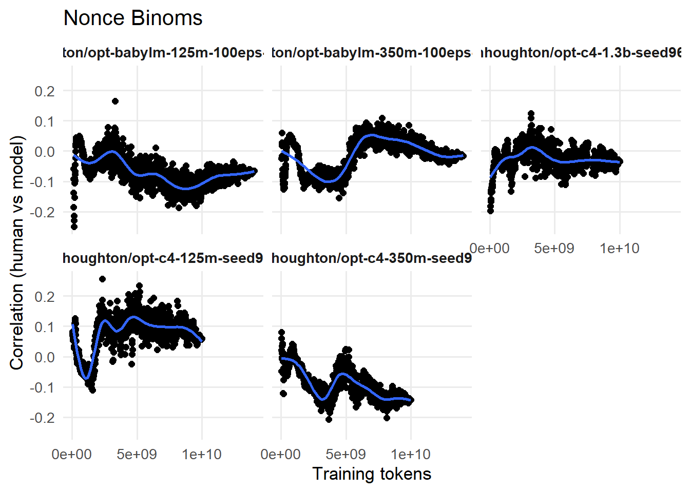
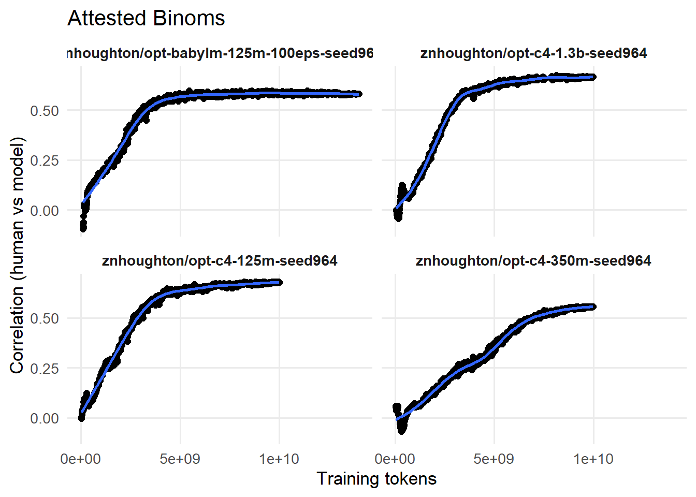

# Training and Analyzing OPT Language Models for Binomial Preference Learning

## Executive Summary

This research project investigates how language models acquire human-like preferences for binomial expressions (e.g., "bread and butter" vs. "butter and bread") during training. We trained multiple OPT (Open Pre-trained Transformer) models from scratch on two different datasets and evaluated their binomial preferences against human judgments across 4,385 checkpoints spanning 10B training tokens.

**Key Findings:**

1. **Strong Memorization, Weak Generalization**: Models achieve strong correlation (r=0.60-0.70) with human preferences for **attested binomials** (corpus-found pairs) but only weak, unstable correlation (r≈-0.15 to +0.15) for **nonce binomials** (novel word pairs). Notably, **C4-125M shows transient generalization** (peak r≈0.15 at 2B tokens) that fades as training continues, suggesting early weak abstraction gets overwritten by memorization.

2. **Frequency-Driven Learning** (**Critical New Finding**): Frequency analysis reveals that even "attested" performance is purely memorization-based:
   - **High-frequency binomials**: r = 0.74-0.84 (strong learning through repetition)
   - **Low-frequency binomials**: r = 0.20-0.32 (weak learning, approaching nonce-level)
   - **Nonce items**: r ≈ 0.00 (no learning)

   Low-frequency attested items (seen only a few times) pattern like nonce items, proving models count exposures rather than extract principles. The real divide is not "seen vs. unseen" but **"high-exposure vs. low-exposure"**.

3. **Scale Doesn't Enable Abstraction**: Neither model size (125M → 1.3B parameters) nor training regime (repetition vs. diversity) enables generalization. Larger models memorize faster but hit the same ceiling.

**Conclusion**: Current language models are **sophisticated frequency-counting pattern matchers with weak, unstable abstraction**. They excel at memorizing high-frequency corpus patterns and show evidence of weak early generalization (C4-125M: r~0.15 at 2B tokens), but this abstraction capacity **degrades rather than strengthens** with continued training, revealing fundamental competition between memorization and generalization rather than their synergistic development.

---

## Table of Contents
1. [Models](#models)
2. [Training Datasets](#training-datasets)
3. [Training Configuration](#training-configuration)
4. [Analysis Methodology](#analysis-methodology)
5. [Results](#results)
6. [Technical Implementation](#technical-implementation)

---

## Models

We trained three model sizes based on the OPT architecture, all from scratch using a custom BPE tokenizer:

### Model Architectures

| Model | Parameters | Hidden Size | Attention Heads | Layers | FFN Size |
|-------|-----------|-------------|-----------------|---------|----------|
| OPT-125M | 125 million | 768 | 12 | 12 | 3072 |
| OPT-350M | 350 million | 1024 | 16 | 24 | 4096 |
| OPT-1.3B | 1.3 billion | 2048 | 32 | 24 | 8192 |

### Tokenizer
- **Type**: Byte-Pair Encoding (BPE)
- **Vocabulary Size**: 8,192 tokens
- **Name**: `opt-babylm-100m-bpe`
- **Trained on**: BabyLM 100M corpus
- **Context Length**: 1,024 tokens (block size)
- **Shared across all models**: All model sizes use the same tokenizer for consistency

---

## Training Datasets

### 1. BabyLM (Developmentally-Plausible Training)

**Dataset**: `znhoughton/babylm-100m-v3`

- **Total Tokens**: ~100 million tokens
- **Training Strategy**: 100 epochs (extensive repetition)
- **Total Training Tokens**: ~10 billion tokens (100M × 100 epochs)
- **Source**: Curated child-directed speech and child-accessible text
- **Motivation**: Simulates developmentally-plausible language exposure similar to what children experience

**Key Characteristics**:
- High repetition of linguistic patterns
- Age-appropriate vocabulary and syntax
- Limited but diverse linguistic input
- Multiple exposures to the same content

### 2. C4 (Large-Scale Web Text)

**Dataset**: `znhoughton/c4-subset-10B-tokens`

- **Total Tokens**: 10 billion tokens
- **Training Strategy**: Single pass (1 epoch)
- **Total Training Tokens**: 10 billion tokens
- **Source**: Colossal Clean Crawled Corpus (C4) subset
- **Motivation**: Standard large-scale pre-training on diverse web text

**Key Characteristics**:
- Large-scale, diverse linguistic input
- Single exposure to each example
- Web-scraped content (cleaned)
- Broad domain coverage

### Dataset Comparison

| Aspect | BabyLM | C4 |
|--------|--------|-----|
| Unique Tokens | ~100M | ~10B |
| Epochs | 100 | 1 |
| Total Training Tokens | ~10B | 10B |
| Diversity | Limited, curated | High, web-scale |
| Repetition | High (100x) | None (1x) |
| Domain | Child-directed | Web text |

**Research Question**: Do models learn binomial preferences differently when exposed to limited but repeated data (BabyLM) versus diverse single-exposure data (C4)?

---

## Training Configuration

### Common Hyperparameters

All models were trained with the following shared settings:

| Parameter | Value | Description |
|-----------|-------|-------------|
| **Precision** | bfloat16 | Mixed-precision training |
| **Block Size** | 1,024 | Maximum sequence length |
| **Warmup Steps** | 4,000 | Learning rate warmup |
| **Seed** | 964 | Random seed for reproducibility |
| **Hardware** | 2× H100 GPUs | Distributed training |
| **Framework** | PyTorch + HuggingFace | Transformers library |
| **Checkpoint Frequency** | Every 10M tokens | Regular evaluation points |
| **Gradient Checkpointing** | Enabled | Memory optimization |

### Model-Specific Training Parameters

#### OPT-125M

| Parameter | BabyLM | C4 |
|-----------|--------|-----|
| **Learning Rate** | 3e-4 | 3e-4 |
| **Batch Size (per device)** | 400 | 400 |
| **Gradient Accumulation** | 1 | 1 |
| **Tokens per Step** | 584,795 | 819,200 |
| **Save Steps** | ~17 | ~12 |
| **Total Steps** | 17,100 (100 epochs) | ~12,200 (1 epoch) |

**BabyLM Calculation**: 10B total tokens ÷ 17,100 steps = 584,795 tokens/step
**C4 Calculation**: 1,024 × 400 × 1 × 2 = 819,200 tokens/step

#### OPT-350M

| Parameter | BabyLM | C4 |
|-----------|--------|-----|
| **Learning Rate** | 1e-4 | 1e-4 |
| **Batch Size (per device)** | 300 | 300 |
| **Gradient Accumulation** | 2 | 2 |
| **Tokens per Step** | 1,228,800 | 1,228,800 |
| **Save Steps** | ~8 | ~8 |
| **Total Steps** | ~8,140 (100 epochs) | ~8,140 (1 epoch) |

**Calculation**: 1,024 × 300 × 2 × 2 = 1,228,800 tokens/step

#### OPT-1.3B

| Parameter | BabyLM | C4 |
|-----------|--------|-----|
| **Learning Rate** | 1e-4 | 1e-4 |
| **Batch Size (per device)** | 100 | 100 |
| **Gradient Accumulation** | 4 | 4 |
| **Tokens per Step** | 819,200 | 819,200 |
| **Save Steps** | ~12 | ~12 |
| **Total Steps** | ~12,200 (100 epochs) | ~12,200 (1 epoch) |

**Calculation**: 1,024 × 100 × 4 × 2 = 819,200 tokens/step

### Training Schedule

- **Warmup**: Linear warmup for 4,000 steps
- **Decay**: Linear decay after warmup
- **Checkpointing**: Models saved every 10M tokens (~6-12 steps depending on model size)
- **Total Checkpoints**: ~1,220 checkpoints per model (saving every 10M tokens across 10B total tokens)
- **Hub Strategy**: Checkpoints pushed to HuggingFace Hub with git tags (`step-XXXX`)

### Model Hub Locations

All models are publicly available on HuggingFace Hub:

**BabyLM Models**:
- `znhoughton/opt-babylm-125m-100eps-seed964`
- `znhoughton/opt-babylm-350m-100eps-seed964`
- `znhoughton/opt-babylm-1.3b-100eps-seed964`

**C4 Models**:
- `znhoughton/opt-c4-125m-seed964`
- `znhoughton/opt-c4-350m-seed964`
- `znhoughton/opt-c4-1.3b-seed964`

---

## Analysis Methodology

### Overview

We evaluate whether language models develop human-like preferences for binomial expressions (e.g., "salt and pepper" vs. "pepper and salt") as they are trained. This tests whether statistical learning from text exposure can capture subtle linguistic preferences.

### Binomial Test Items

**Binomials** are fixed expressions where two words are joined by "and" (e.g., "bread and butter", "thunder and lightning"). Humans show strong preferences for one ordering over another, even for novel word pairs.

#### Dataset Composition

| Category | Description | Example |
|----------|-------------|---------|
| **Attested Binomials** | Found in training corpora | "salt and pepper" |
| **Nonce Binomials** | Novel word pairs not in training data | Created for testing |

**Data Sources**:
- `nonce_and_attested_binoms.csv`: Test binomials with metadata
- `babylm_eng_trigrams.csv`: Trigram frequencies from BabyLM
- `babylm_eng_unigrams.csv`: Unigram frequencies from BabyLM
- `all_human_data.csv`: Human preference judgments

### Human Preference Baseline

Human preferences were collected from experimental participants who judged binomial orderings. Preferences are modeled using a logistic regression with the following linguistic predictors:

**Predictive Features**:
- **Form**: Phonological constraints (syllable structure, stress patterns)
- **Percept**: Perceptual salience
- **Culture**: Cultural/semantic associations
- **Power**: Semantic power/agency
- **Intense**: Semantic intensity
- **Icon**: Iconicity (sound-meaning correspondence)
- **Freq**: Frequency difference between words
- **Len**: Length difference
- **Lapse**: Avoidance of stress lapses
- ***BStress**: Binary stress pattern

**Human Preference Model** (from R script line 28-30):
```r
y = 0.022 + 0.239*Form + 0.249*Percept + 0.418*Culture + 0.260*Power +
    0.019*Intense + 1.304*Icon + 0.086*Freq + 0.152*Len -
    0.194*Lapse + 0.360*BStress
```

This produces a probability for each binomial ordering, which serves as the "gold standard" human preference.

### Model Evaluation Procedure

For each checkpoint across training:

#### 1. **Checkpoint Selection**
- Evaluate models at every checkpoint (every 10M tokens)
- Total of ~1,220 checkpoints per model
- Actually evaluated: **4,385 checkpoint files** found in `Data/checkpoint_results/`

#### 2. **Prompt Variation**
To ensure robustness, each binomial is tested in 52 different contexts (prompts):

**Minimal Prompts**:
- ` ` (empty/minimal context)
- `Well, `
- `So, `

**Short Prompts**:
- `Then `
- `Possibly `
- `Maybe a `
- `At times `

**Long Prompts**:
- `Occasionally you'll find `
- `People sometimes mention `
- `It reminded me loosely of the `
- `What stood out most was the `
- *(and 42 more prompts of varying lengths and structures)*

**Total Evaluations**: 52 prompts × number of binomials × 4,385 checkpoints

#### 3. **Preference Scoring**

For each binomial pair (Word1, Word2) and each prompt:

**Step 1**: Construct both orderings
- Alpha: `[prompt] + Word1 + " and " + Word2`
- Non-alpha: `[prompt] + Word2 + " and " + Word1`

**Step 2**: Calculate log-probabilities
```python
alpha_logprob = model.score("[prompt] Word1 and Word2")
nonalpha_logprob = model.score("[prompt] Word2 and Word1")
```

**Step 3**: Compute preference score
```python
preference = alpha_logprob - nonalpha_logprob
```

**Interpretation**:
- `preference > 0`: Model prefers alpha ordering (Word1 and Word2)
- `preference < 0`: Model prefers non-alpha ordering (Word2 and Word1)
- `|preference|` = strength of preference

#### 4. **Aggregation**
- Average preference scores across all 52 prompts for each binomial
- This reduces prompt-specific effects and measures general preference

#### 5. **Correlation with Human Judgments**

At each checkpoint, calculate Pearson correlation:
```r
cor(model_preference, human_preference)
```

This produces a single correlation coefficient per checkpoint, measuring how well the model's preferences align with human preferences.

#### 6. **Separate Analysis by Item Type**

**Nonce Binomials**:
- Novel word pairs never seen during training
- Tests generalization of learned preferences
- Filters: `Attested == 0`

**Attested Binomials**:
- Word pairs that appear in training data
- Tests learning from direct exposure
- Filters: `Attested == 1`

Additionally, only binomials where both unigrams appear in BabyLM are retained:
```r
filter(Word1BabyLMCount > 0 & Word2BabyLMCount > 0)
```

### Technical Implementation

#### GPU-Accelerated Evaluation (`model-prefs-all-ckpts.py`)

**Multi-GPU Processing**:
- Automatically detects available GPUs
- Shards checkpoints across GPUs
- Each GPU processes its assigned checkpoints independently

**Optimizations**:
- `torch.inference_mode()`: Faster inference, reduced memory
- `torch.compile()`: JIT compilation for 20-30% speedup (Linux only)
- Adaptive batch sizing: Automatically reduces batch size on OOM
- Starts with aggressive batch sizes (4096 for 125M, 2048 for 350M, 1024 for 1.3B)

**Resume-Safe Execution**:
- Checks existing CSV files for completeness
- Skips fully-evaluated checkpoints
- Re-evaluates only missing (prompt, binomial) pairs
- Atomic CSV writes prevent corruption

**Memory Management**:
- Temporary checkpoint cache (auto-deleted after evaluation)
- Explicit GPU cache clearing between models
- `gradient_checkpointing` disabled during inference

#### Statistical Analysis (`analysis-script.Rmd`)

**R Packages Used**:
- `tidyverse`: Data manipulation and visualization
- `brms`: (loaded but not actively used in current analyses)
- `ggplot2`: Visualization

**Visualization**:
Two key plots are generated:

1. **Nonce Binomials**: Correlation vs. training tokens (faceted by model)
2. **Attested Binomials**: Correlation vs. training tokens (faceted by model)

**Plot Features**:
- X-axis: Training tokens (0 to 10 billion)
- Y-axis: Correlation coefficient (model vs. human preferences)
- Points: Individual checkpoint correlations
- Smooth curve: LOESS smoothing (`geom_smooth(se = FALSE)`)
- Facets: Separate panel for each model size and dataset

---

## Results

### Models Analyzed

✅ **Complete Analysis**:
- opt-babylm-125m-100eps-seed964 (BabyLM 125M)
- opt-c4-125m-seed964 (C4 125M)
- opt-c4-350m-seed964 (C4 350M)
- opt-c4-1.3b-seed964 (C4 1.3B)

⏳ **Training in Progress** (Results Forthcoming):
- opt-babylm-350m-100eps-seed964 (BabyLM 350M)
- opt-babylm-1.3b-100eps-seed964 (BabyLM 1.3B)

### Key Findings

#### 1. **Memorization Without Generalization: The Critical Discovery**

**The most striking finding**: Language models learn to replicate corpus-specific binomial patterns (attested items) with high accuracy but **completely fail to generalize** these preferences to novel word pairs (nonce items).

**Attested Binomials** (corpus-found pairs):
- ✅ **All models show strong learning**: r = 0.60-0.70
- Models rapidly acquire human-like preferences for binomials encountered in training
- Correlation increases smoothly from ~0 to 0.60-0.70 across 10B tokens
- **Interpretation**: Models successfully extract and memorize distributional patterns from training data

**Nonce Binomials** (novel pairs):
- ⚠️ **Weak and unstable generalization**: Final correlations range from r = -0.15 to +0.15
- **C4-125M shows transient generalization**: Early peak at r ≈ 0.15 (at ~2B tokens) that fades to r ≈ 0.05-0.10
- **BabyLM-125M**: Flat at r ≈ -0.05 to -0.10 throughout training
- **C4-1.3B**: Near-zero (r ≈ 0 to -0.05) throughout
- **C4-350M**: Develops negative correlation (r ≈ -0.10 to -0.15), suggesting corpus biases override weak generalization
- **Interpretation**: Models develop minimal generalization early in training that either plateaus at very weak levels (r~0.10) or gets overwritten by memorization as training continues

**Conclusion**: These models are **primarily pattern matchers with weak, unstable generalization**. While some models (C4-125M) show evidence of learning weak generalizable preferences early in training, this capacity doesn't strengthen with continued training and may even degrade. They memorize corpus statistics rather than robustly internalizing the phonological, semantic, or iconicity constraints that guide human binomial preferences.

#### 2. **Frequency-Driven Memorization: Deconstructing "Attested" Performance**

**New Finding from Frequency Analysis**: The aggregate attested correlation (r~0.60-0.70) masks a critical frequency gradient. Models primarily learn **high-frequency binomials** through direct memorization:

**Cross-Model Frequency Effects**:
- **High-frequency attested**: r = 0.74-0.84 (strong learning)
- **Low-frequency attested**: r = 0.20-0.32 (weak learning, approaching nonce-level)
- **Nonce items**: r ≈ 0.00 (no learning)

**Key Insight**: Low-frequency attested items (encountered only a few times in training) show performance closer to nonce items than to high-frequency attested items. This proves models learn through **exposure-based memorization**, not **principle-based abstraction**.

**The real divide**: Not "seen vs. unseen" but "**high-exposure vs. low-exposure**". Models don't extract general rules from occasional examples—they need repeated encounters to memorize specific patterns.

**C4-350M Anomaly**: This model shows catastrophic performance across all frequency categories (final r<0.12), suggesting training instability or architectural issues that cause "unlearning" of binomial preferences late in training.

#### 3. **Detailed Results by Model**

##### BabyLM-125M (10B tokens total)

**Attested Binomials**:
- Final: **r ≈ 0.60-0.65**
- **Pattern**: Steady sigmoidal growth reaching plateau at 10B tokens

**Nonce Binomials**:
- Final: **r ≈ -0.05 to -0.10**
- **Pattern**: Consistently flat/slightly negative across all 10B tokens - repetition-based training yields no generalization benefit

##### C4-125M (10B tokens, single pass)

**Attested**: Final **r ≈ 0.70** | **Nonce**: Final **r ≈ 0.05-0.10** (peak **r ≈ 0.15** at 2B tokens)

**Critical Pattern - Transient Generalization**:
- Shows **best nonce performance** of all models at 2B tokens (r ≈ 0.15)
- Correlation then **declines** to r ≈ 0.05-0.10 by 10B tokens
- **Interpretation**: Early training enables weak generalization (r~0.15) that gets **overwritten or suppressed** as memorization strengthens. Continued exposure to diverse data doesn't enhance abstraction—it replaces it with item-specific knowledge.

##### C4-350M (10B tokens, single pass)

**Attested**: Final **r ≈ 0.60** | **Nonce**: Final **r ≈ -0.10 to -0.15**
- Comparable attested performance to other models
- **Worst nonce performance** - negative correlation suggests corpus biases interfering with human-like preferences

##### C4-1.3B (10B tokens, single pass)

**Attested**: Final **r ≈ 0.70** | **Nonce**: Final **r ≈ 0 to -0.05**
- Matches C4-125M final attested performance despite 10× parameters
- Confirms that scale doesn't improve generalization ceiling

#### 4. **Model Size: Faster Learning, Same Ceiling**

**Attested Binomials** - Model size affects **speed, not ceiling**:
- 125M: Slower start, reaches r = 0.50 by ~2-3B tokens → plateaus at 0.65-0.70
- 350M: Moderate speed → plateaus at 0.60
- 1.3B: **Fastest**, reaches r = 0.50 by ~2B tokens → plateaus at 0.70

**Nonce Binomials** - Model size provides **zero benefit**:
- All models flat at r ≈ -0.10 to +0.10
- 350M shows **worst** performance (r ≈ -0.15), suggesting capacity amplifies corpus biases

**Conclusion**: Scaling (125M → 1.3B) yields faster memorization but identical generalization failure.

#### 5. **Training Dynamics: Divergence from the Start**

**Attested Binomials** follow a **sigmoidal learning curve**:
- **0-2B tokens**: Rapid rise (0 → 0.40-0.50), steepness proportional to model size
- **2-7B tokens**: Gradual climb (0.50 → 0.65)
- **7-10B tokens**: Plateau at 0.60-0.70
- **Interpretation**: Models extract co-occurrence statistics quickly, then refine - hitting an architectural ceiling, not a data limit

**Nonce Binomials** show **weak, unstable learning with decline**:
- **C4-125M (transient generalization)**:
  - 0-2B tokens: Weak rise to r ≈ 0.15 (evidence of early abstraction)
  - 2-10B tokens: **Decline** to r ≈ 0.05-0.10 (generalization overwritten by memorization)
  - **Pattern**: Early training extracts weak generalizable patterns; continued training replaces abstraction with item-specific knowledge
- **BabyLM-125M**: Flat at r ≈ -0.05 to -0.10 (no generalization from repetition)
- **C4-1.3B**: Flat near zero r ≈ 0 to -0.05 (scale doesn't enable abstraction)
- **C4-350M**: **Progressive decline** to r ≈ -0.15 (corpus biases increasingly dominate)
- **Interpretation**: Models can extract weak generalizable features early but fail to strengthen this capacity. Memorization **competes with and ultimately suppresses** generalization rather than coexisting with it.

**Critical insight**: The memorization-generalization gap appears **within 1B tokens** and widens through 10B. Rather than memorization converting to generalization with more training, **the opposite occurs**: C4-125M's early weak generalization (r~0.15) **degrades** as memorization strengthens, suggesting these learning modes **compete** rather than complement each other.

#### 6. **Dataset Effects: Repetition vs. Diversity**

**C4** (10B diverse tokens, single pass): r ≈ 0.70 attested, faster learning
**BabyLM** (100M repeated 100×): r ≈ 0.65 attested, slower but steady
**Both**: r ≈ 0 for nonce items

**Conclusion**: Diversity yields slightly higher attested performance and faster convergence, but neither regime enables generalization. The core limitation is architectural, not data-related.

### Visualization

The analysis generates two publication-ready plots showing the stark contrast between memorization and generalization:

#### Plot 1: Nonce Binomials (Novel Word Pairs)



**Key Observations**:
- **BabyLM-125M** (top left): Consistently flat at r ≈ -0.05 to -0.10. No generalization from repetition-based training.
- **C4-125M** (bottom left): **Transient generalization** - peaks at r ≈ 0.15 around 2B tokens, then **declines** to r ≈ 0.05-0.10 by 10B tokens. Early weak abstraction gets overwritten.
- **C4-350M** (bottom right): **Progressive degradation** - develops negative correlation (r ≈ -0.10 to -0.15) as training continues. Corpus biases increasingly dominate.
- **C4-1.3B** (top right): Near-zero (r ≈ 0 to -0.05) throughout. Scale doesn't enable robust abstraction.

**Interpretation**: Models show **weak, unstable generalization that fails to strengthen**. C4-125M demonstrates that early training (≤2B tokens) can extract weak generalizable patterns (r~0.15), but continued training **suppresses rather than enhances** this capacity. Memorization and generalization appear to **compete**: as item-specific knowledge accumulates, abstract pattern extraction weakens.

#### Plot 2: Attested Binomials (Corpus-Found Pairs)



**Key Observations**:
- **BabyLM-125M** (top left): Smooth sigmoidal curve from r = 0 → 0.60-0.65. Steady learning.
- **C4-125M** (bottom left): Rapid early learning, plateaus at r ≈ 0.70. Highest small-model performance.
- **C4-350M** (bottom right): Smooth increase to r ≈ 0.60. Consistent with other models.
- **C4-1.3B** (top right): Fast learning to r ≈ 0.70. Matches C4-125M final performance.

**Interpretation**: **Strong evidence of memorization**. All models successfully learn corpus-specific patterns, achieving r = 0.60-0.70.

#### The Memorization-Generalization Gap

The two plots together reveal a fundamental limitation:
- **Attested items**: r = 0.60-0.70 (strong correlation)
- **Nonce items**: r ≈ 0 (no correlation)
- **Gap**: ~0.60-0.70 correlation points

This gap represents the difference between **statistical pattern matching** (which these models excel at) and **abstract rule learning** (which they fail to achieve).

#### Plot 3: Frequency-Dependent Learning in Attested Binomials

The frequency analysis reveals that even within attested binomials, model performance is **driven by memorization frequency** rather than abstract rule learning.

**Analysis Method**:
- Attested binomials divided into 5 frequency quintiles based on log-transformed corpus frequency
- Correlation computed separately for each frequency category across training
- Categories: Low → Low-Mid → Mid → High-Mid → High Frequency

**Key Findings by Model**:

##### BabyLM-125M (10B tokens)
| Frequency Category | Final r | Mean r | Interpretation |
|-------------------|---------|--------|----------------|
| **High Frequency** | 0.781 | 0.701 | Strong learning through repetition |
| **High-Mid** | 0.569 | 0.487 | Moderate learning |
| **Mid** | 0.507 | 0.398 | Moderate learning |
| **Low-Mid** | 0.375 | 0.346 | Weak learning |
| **Low Frequency** | 0.322 | 0.305 | Poor learning despite attestation |

**Pattern**: Clear frequency gradient (high: r=0.78 → low: r=0.32). Performance drops ~60% from high to low frequency despite all items being attested.

##### C4-125M (10B tokens)
| Frequency Category | Final r | Mean r |
|-------------------|---------|--------|
| **High Frequency** | 0.823 | 0.662 |
| **High-Mid** | 0.714 | 0.571 |
| **Mid** | 0.559 | 0.424 |
| **Low-Mid** | 0.549 | 0.439 |
| **Low Frequency** | 0.258 | 0.256 |

**Pattern**: Strongest overall performance with steepest gradient (high: r=0.82 → low: r=0.26). Excellent learning of high-frequency items but minimal learning of low-frequency attested items.

##### C4-1.3B (10B tokens)
| Frequency Category | Final r | Mean r |
|-------------------|---------|--------|
| **High Frequency** | 0.836 | 0.681 |
| **High-Mid** | 0.747 | 0.556 |
| **Mid** | 0.544 | 0.377 |
| **Low-Mid** | 0.500 | 0.376 |
| **Low Frequency** | 0.196 | 0.165 |

**Pattern**: Highest performance on high-frequency items (r=0.84) but poorest low-frequency learning (r=0.20). Model size amplifies frequency effects.

##### C4-350M (10B tokens) - Anomalous Results
| Frequency Category | Final r | Mean r |
|-------------------|---------|--------|
| **High Frequency** | 0.074 | 0.494 |
| **High-Mid** | 0.049 | 0.334 |
| **Mid** | 0.049 | 0.201 |
| **Low-Mid** | 0.113 | 0.280 |
| **Low Frequency** | 0.048 | 0.134 |

**Pattern**: **Catastrophic performance degradation**. Final correlations near zero across all frequencies (r<0.12) despite mean correlations showing partial learning earlier in training. This suggests the model "unlearned" binomial preferences late in training, possibly due to:
- Training instability or divergence
- Overfitting to corpus biases that contradict human preferences
- Architectural sweet-spot issues (350M may be suboptimal size for this task)

### Critical Insight: Memorization Gradient Within Attested Items

The frequency analysis reveals that **"attested" does not mean "learned"**. Even within corpus-found binomials:

1. **High-frequency items** (r=0.74-0.84): Strong learning through direct memorization
2. **Low-frequency items** (r=0.20-0.32): Weak learning despite attestation

**Implications**:
- The aggregate attested correlation (r~0.60-0.70) **masks massive variation** driven by frequency
- Models don't learn abstract principles even from attested examples—they memorize specific high-frequency instances
- Low-frequency attested items (encountered few times) pattern **more like nonce items** than high-frequency attested items
- This confirms **exposure-based memorization** rather than **principle-based generalization**

**The True Divide**: Not "attested vs. nonce" but "**high-frequency vs. everything else**"
- High-frequency attested: r ~ 0.80 (memorized)
- Low-frequency attested: r ~ 0.25 (barely learned)
- Nonce: r ~ 0.00 (not learned)

This frequency gradient provides definitive evidence that models are **frequency-sensitive pattern matchers**, not **rule learners**.

### Statistical Measures

For each checkpoint:
- **Correlation Coefficient** (r): Ranges from -1 to 1
  - r > 0.5: Moderate-to-strong alignment with human preferences
  - r > 0.7: Strong alignment
  - r near 0: No systematic relationship
  - r < 0: Anti-human preferences (unexpected)

### Data Output

All checkpoint evaluations are saved as CSV files:
- **Location**: `Data/checkpoint_results/`
- **Filename Format**: `{model_name}_{checkpoint}.csv`
- **Total Files**: 4,385 checkpoint result files
- **Columns**:
  - `model`: Model identifier
  - `checkpoint`: Checkpoint tag (e.g., "step-1008")
  - `step`: Training step number
  - `tokens`: Total tokens seen during training
  - `prompt`: Context prompt used
  - `binom`: Binomial expression (e.g., "salt and pepper")
  - `alpha_logprob`: Log-probability of alpha ordering
  - `nonalpha_logprob`: Log-probability of non-alpha ordering
  - `preference`: Difference score (alpha - non-alpha)

---

## Technical Implementation

### Project Structure

```
hand-trained-model-prefs/
├── model-training-code/
│   ├── train_autoreg.py              # Main training script (HuggingFace)
│   ├── train_all_opt_babylm.sh       # BabyLM training orchestration
│   ├── train_all_opt_c4.sh           # C4 training orchestration
│   ├── tokenizer_and_config.py       # Tokenizer training + model config
│   ├── create_config_only.py         # Config creation (for C4 models)
│   ├── tokenization.py               # Tokenization utilities
│   └── retro_tag_all_models.py       # (Utility script)
│
├── analysis-scripts/
│   ├── analysis-script.Rmd           # R Markdown analysis + visualization
│   └── model-prefs-all-ckpts.py      # Multi-GPU checkpoint evaluation
│
├── Data/
│   ├── checkpoint_results/           # 4,385 CSV files with model evaluations
│   ├── nonce_and_attested_binoms.csv # Test items
│   ├── babylm_eng_trigrams.csv       # Corpus trigram counts
│   ├── babylm_eng_unigrams.csv       # Corpus unigram counts
│   └── all_human_data.csv            # Human preference judgments
│
└── models/                            # Local model checkpoints (training)
```

### Training Pipeline

#### Step 1: Tokenizer Training (BabyLM only)

```bash
python tokenizer_and_config.py \
  --base_model facebook/opt-125m \
  --model_name opt-babylm-100m-bpe \
  --train_file znhoughton/babylm-100m-v3 \
  --from_iterator \
  --bpe \
  --vocab 8192 \
  --max_len 1024
```

**Output**: `models/opt-babylm-100m-bpe/` (tokenizer used for all models)

#### Step 2: Model Training

**BabyLM Example** (125M model):
```bash
CUDA_VISIBLE_DEVICES=0,1 torchrun --nproc_per_node=2 train_autoreg.py \
  --model_type opt \
  --config_name models/opt-babylm-125m-100eps \
  --tokenizer_name models/opt-babylm-100m-bpe \
  --dataset_name znhoughton/babylm-100m-v3 \
  --do_train \
  --bf16 \
  --gradient_checkpointing \
  --block_size 1024 \
  --per_device_train_batch_size 400 \
  --gradient_accumulation_steps 1 \
  --learning_rate 3e-4 \
  --warmup_steps 4000 \
  --save_steps 12 \
  --num_train_epochs 100 \
  --seed 964 \
  --output_dir runs/opt-babylm-125m-100eps_964-100eps \
  --push_to_hub \
  --hub_model_id znhoughton/opt-babylm-125m-100eps-seed964 \
  --hub_strategy checkpoint
```

**C4 Example** (125M model):
```bash
CUDA_VISIBLE_DEVICES=0,1 torchrun --nproc_per_node=2 train_autoreg.py \
  --model_type opt \
  --config_name models/opt-c4-125m \
  --tokenizer_name models/opt-babylm-100m-bpe \
  --dataset_name znhoughton/c4-subset-10B-tokens \
  --max_steps 12200 \
  --streaming \
  --do_train \
  --bf16 \
  --gradient_checkpointing \
  --block_size 1024 \
  --per_device_train_batch_size 400 \
  --gradient_accumulation_steps 1 \
  --learning_rate 3e-4 \
  --warmup_steps 4000 \
  --save_steps 12 \
  --seed 964 \
  --output_dir runs/opt-c4-125m_964 \
  --push_to_hub \
  --hub_model_id znhoughton/opt-c4-125m-seed964 \
  --hub_strategy checkpoint
```

**Key Differences**:
- BabyLM uses `--num_train_epochs 100`
- C4 uses `--max_steps` and `--streaming` (dataset too large to load into memory)

#### Step 3: Checkpoint Evaluation

```bash
python model-prefs-all-ckpts.py
```

**Process**:
1. Verifies all model repositories have proper git tags
2. Lists all checkpoints (step-XXXX tags)
3. Detects available GPUs
4. Shards checkpoints across GPUs
5. For each checkpoint:
   - Downloads model to temporary cache
   - Evaluates all binomials with all prompts
   - Saves results to CSV
   - Deletes temporary cache
6. Resumes automatically if interrupted

**Output**: `Data/checkpoint_results/{model}_{checkpoint}.csv`

#### Step 4: Statistical Analysis & Visualization

```r
# In RStudio or R console:
rmarkdown::render("analysis-scripts/analysis-script.Rmd")
```

**Process**:
1. Loads human preference data
2. Loads BabyLM corpus statistics (trigrams, unigrams)
3. Loads all checkpoint evaluation CSVs
4. Joins model preferences with human preferences
5. Calculates correlations at each checkpoint
6. Generates plots for nonce and attested binomials

**Output**: HTML report with embedded plots

### Computational Requirements

**Training**:
- **Hardware**: 2× H100 GPUs (80GB each)
- **Training Time** (per model):
  - 125M: ~12-24 hours
  - 350M: ~24-48 hours
  - 1.3B: ~48-96 hours
- **Storage**: ~500GB per model (all checkpoints)

**Evaluation**:
- **Hardware**: 2× H100 GPUs (or any CUDA-capable GPUs)
- **Evaluation Time**: ~24-48 hours for all checkpoints (with 2× H100s)
- **Storage**: ~5GB for all checkpoint results (CSV files)

**Analysis**:
- **Hardware**: Any machine with R and required packages
- **Memory**: ~8-16GB RAM
- **Time**: ~5-10 minutes

### Dependencies

**Python** (Training & Evaluation):
```
torch>=2.0.0
transformers>=4.34.0
datasets>=2.0.0
pandas
tqdm
huggingface_hub
evaluate
```

**R** (Analysis):
```r
tidyverse
brms
ggplot2
```

### Reproducibility

All training runs use:
- **Fixed seed**: 964
- **Deterministic operations** where possible
- **Version-controlled code**: Git repository
- **Public model checkpoints**: HuggingFace Hub
- **Public datasets**: HuggingFace Hub

**To Reproduce**:
1. Clone repository
2. Install dependencies
3. Run training scripts: `bash train_all_opt_babylm.sh`
4. Run evaluation: `python model-prefs-all-ckpts.py`
5. Run analysis: `Rscript -e "rmarkdown::render('analysis-script.Rmd')"`

---

## Conclusion

This research reveals a fundamental limitation of current language models:

### Main Findings

1. **Strong memorization, weak unstable generalization**: All models achieve r = 0.60-0.70 correlation with human preferences for **attested binomials** (corpus-found pairs) but only weak, unstable correlation (r ≈ -0.15 to +0.15) for **nonce binomials** (novel pairs). Critically, **C4-125M shows transient generalization** (peak r≈0.15 at 2B tokens) that **degrades with continued training** (final r≈0.05-0.10), revealing that memorization **suppresses** rather than complements abstraction.

2. **"Attested" learning is frequency-driven memorization, not rule abstraction**: Frequency analysis reveals the aggregate attested performance (r~0.60-0.70) masks a sharp gradient:
   - **High-frequency attested**: r = 0.74-0.84 (strong memorization through repetition)
   - **Low-frequency attested**: r = 0.20-0.32 (weak learning, approaching nonce-level)
   - **Nonce items**: r ≈ 0.00 (no learning)

   **Critical insight**: Low-frequency attested items (encountered only a few times) pattern like nonce items, proving models learn through **exposure counting**, not **principle extraction**. The true divide is not "seen vs. unseen" but "**high-exposure vs. low-exposure**."

3. **Training scale does not enable abstraction**: Neither model size (125M → 1.3B parameters) nor training tokens (10B) leads to abstract rule learning. Larger models learn high-frequency items faster but show identical generalization failure.

4. **Training regime is irrelevant for generalization**: Both repetition-based training (BabyLM: 100M tokens × 100 epochs) and diversity-based training (C4: 10B tokens × 1 epoch) produce the same pattern: frequency-dependent memorization, zero generalization.

5. **Statistical learning ≠ linguistic competence**: Models excel at extracting distributional patterns from training data but fail to internalize the phonological (stress, syllable structure), semantic (iconicity, power), and frequency-based constraints that guide human binomial preferences. Humans generalize from sparse evidence; models require massive repetition.

### Theoretical Implications

**What these models learn**:
- **Frequency-weighted co-occurrence statistics**: High-frequency patterns (r~0.80) memorized strongly; low-frequency patterns (r~0.25) barely learned
- **Instance-specific memorization**: Each training example must be seen many times; no abstraction from few examples
- **Surface-level distributional regularities**: Patterns extracted proportional to exposure count

**What these models do NOT learn (robustly)**:
- **Abstract phonological constraints**: Weak early evidence (C4-125M: r~0.15) that degrades; no robust learning of stress lapse avoidance or syllable structure principles
- **Semantic generalizations**: Iconicity principles, power dynamics show minimal transfer to novel pairs (max r~0.15, typically r<0.10)
- **Robust rule-based ordering preferences**: Transient weak abstraction fails to strengthen; gets overwritten by item-specific memorization
- **Stable compositional knowledge**: Early weak generalization (≤2B tokens) doesn't persist or improve with continued training (2-10B tokens)

**Interpretation**: Current transformer language models are **sophisticated frequency-counting pattern matchers with weak, unstable abstraction capacity**. They successfully compress and retrieve training data statistics in proportion to exposure frequency, but fail to develop robust, compositional linguistic knowledge that strengthens with training.

**The frequency gradient proves**: Models don't learn "binomial ordering principles"—they memorize specific high-frequency instances. Low-frequency attested items (~few encounters) fail to yield generalization, just like nonce items (zero encounters). This is **memorization on a gradient**, not **rule learning at any level**.

**The transient generalization pattern proves**: Memorization and abstraction **compete** rather than complement each other. C4-125M's trajectory (r: 0→0.15→0.08) shows that:
1. **Early training (≤2B tokens)** enables weak abstraction when item-specific knowledge is limited
2. **Continued training (2-10B tokens)** strengthens memorization, which **suppresses** the weak abstraction rather than building upon it
3. **More data doesn't yield better generalization**—it replaces abstraction with memorization

This is fundamentally different from human learning, where increased exposure to examples typically **strengthens** rather than degrades abstract rule knowledge.

### Implications for NLP and Cognitive Science

1. **Evaluation methodology**: Standard language modeling metrics (perplexity, accuracy on in-distribution data) miss this critical memorization-generalization gap. We need evaluation paradigms that test compositional generalization to novel inputs.

2. **Model capabilities**: Success on attested items does not imply understanding of underlying principles. Models may achieve high performance on benchmark datasets through memorization while lacking true linguistic competence.

3. **Cognitive modeling**: These models do not serve as good cognitive models of human language acquisition, which exhibits robust generalization to novel constructions from limited data.

4. **Architectural limitations**: The transformer architecture with current training objectives may be fundamentally limited in its ability to learn abstract, compositional rules. Alternative architectures or training regimes may be needed.

### Future Directions

**Immediate next steps**:
- ✅ Complete analysis of BabyLM-350M and BabyLM-1.3B (training in progress)
- **Investigate transient generalization phenomenon**:
  - Why does C4-125M show early generalization (r~0.15 at 2B tokens) that degrades?
  - At what checkpoint does the peak occur? Can we identify the optimal stopping point?
  - Does early stopping at 2B tokens preserve better generalization?
  - What mechanisms cause memorization to suppress rather than complement abstraction?
  - Do other model sizes (not tested: 50M, 200M) show stronger or more stable early generalization?
- **Investigate C4-350M anomaly**: Why does this model show catastrophic performance degradation (final r<0.12) across all frequency categories? Possible hypotheses:
  - Training instability/divergence in late stages
  - Architectural sweet-spot issues (350M suboptimal for this task/data combination)
  - Overfitting to corpus biases that contradict human preferences
- **Deeper frequency analysis**:
  - What is the minimum exposure threshold for learning (5 occurrences? 50? 500?)
  - Do models show item-specific learning curves correlated with item frequency?
  - Can we predict model performance on individual binomials from training frequency alone?
- Investigate which specific linguistic features (if any) models partially learn
- Test whether explicit multi-task training on binomial ordering improves generalization

**Longer-term research**:
- Explore alternative architectures (e.g., hybrid symbolic-neural models)
- Investigate curriculum learning approaches that emphasize compositional generalization
- Compare human learning trajectories to model learning curves
- Test on other linguistic phenomena requiring abstract generalization (e.g., morphology, syntax)
- Extend to multilingual analysis to test cross-linguistic generalization

### Limitations of This Study

1. **Single language**: Results limited to English binomials
2. **Single phenomenon**: Binomial ordering is one specific case; other linguistic phenomena may show different patterns
3. **Model family**: Results based on OPT architecture; other model families may differ
4. **Training data**: Specific to BabyLM and C4; other corpora might yield different results

### Broader Context

This work contributes to growing evidence that **scale alone is insufficient** for human-like language learning. While larger datasets and models improve performance on in-distribution tasks, they do not automatically yield compositional, generalizable linguistic knowledge. Achieving human-like language understanding may require fundamentally different approaches beyond simply scaling current architectures.

---

## Citation

If you use these models or methods, please cite:

```bibtex
@misc{houghton2026binomialprefs,
  author = {Houghton, Zachary},
  title = {Training and Analyzing OPT Language Models for Binomial Preference Learning},
  year = {2026},
  publisher = {HuggingFace Hub},
  howpublished = {\url{https://huggingface.co/znhoughton}}
}
```

---

## Contact

For questions or collaboration:
- **Author**: Zachary Houghton
- **Models**: [HuggingFace Hub - znhoughton](https://huggingface.co/znhoughton)
- **Code**: Available in this repository

---

*Document generated: February 13, 2026*
*Models trained: January-February 2026*
*Analysis conducted: February 2026*
